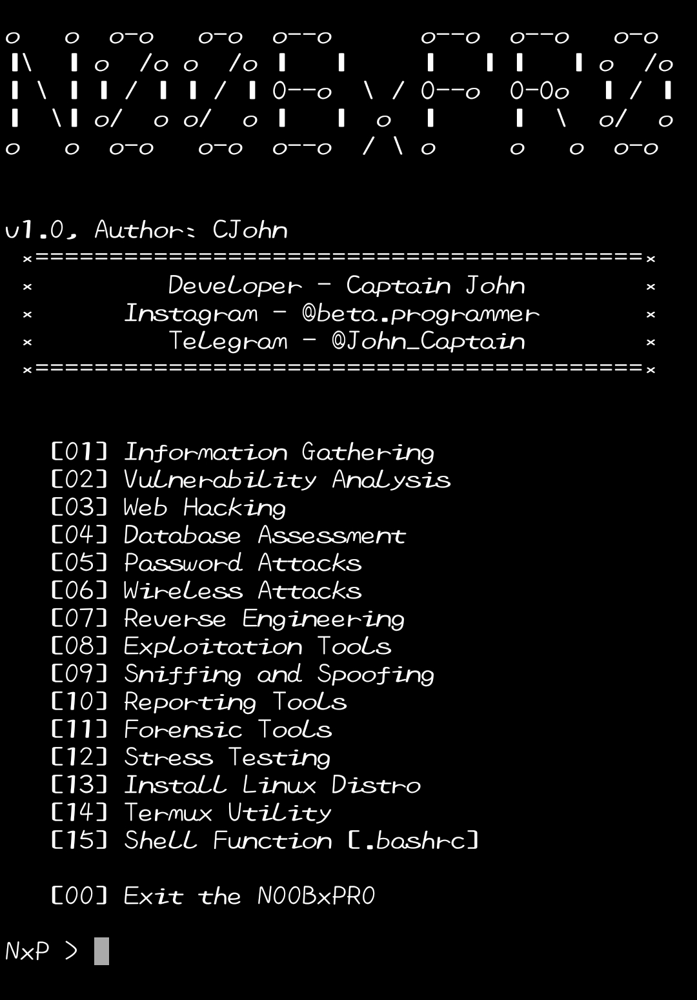

# N00BxPR0
N00BxPR0 tools installer is very easy to use, only provided for N00B termux users, just kidding.
N00BxPR0 is a tool that is specially made for termux user which provides a lot of tool mainly used tools in termux, N00BxPR0 install any of the given tools provided by it from itself with just one click, and N00BxPR0 always get updated.

Made with ❤️

## Screenshot


### Requirements
• Python 3.x

#### Installation and Using N00BxPR0
```bash
apt install python git
git clone https://github.com/captainjohnexe/NxP.git
cd NxP
python N00BxPR0.py
```

### Contact Me
Instagram: @beta.programmer  
Telegram : @John_Captain
